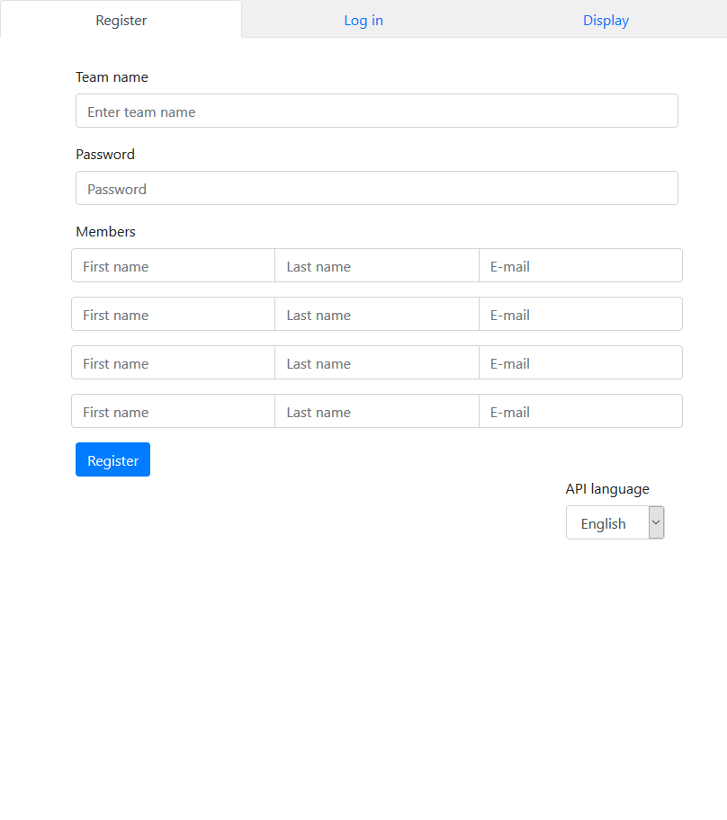

# Rozi_jednorozi

Pošto na danom API serveru nije postavljen CORS, ovaj kôd je pisan pod pretpostavkom da se nalazi na istoj domeni kao i sam API server.

Na demonstraciji ispod server je lokalno simuliran, ali trebao bi se ponašati identično kao i stvarni server.

----

